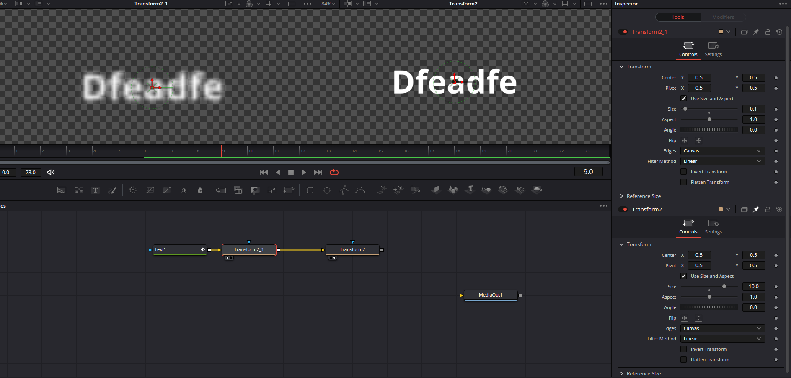
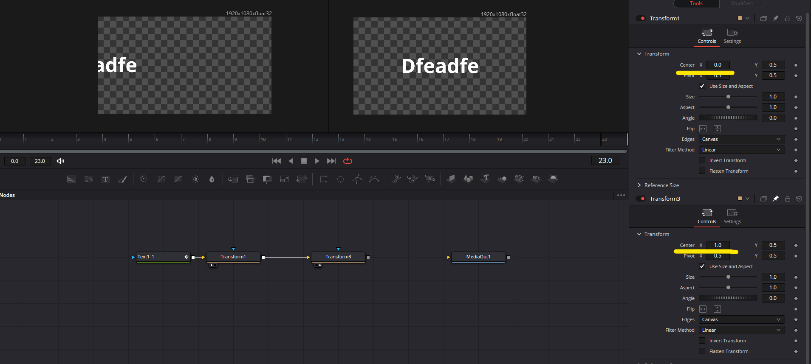
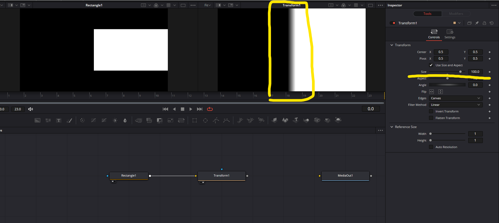
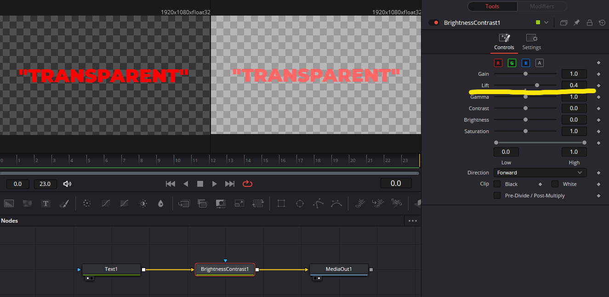
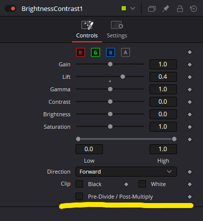
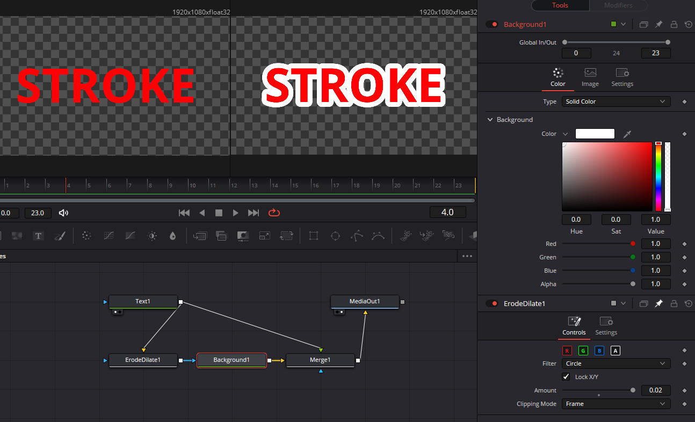

# Fusion FAQ

## I have no idea how to use Fusion. Where to start?

Watch this video.

- [FUSION: THE ULTIMATE BEGINNERS GUIDE - DaVinci Resolve 17 Tutorial](https://www.youtube.com/watch?v=MDpR2xluwvI)

## Can you make a parameter have the same value as another?

Yes. There are two ways to do it. One way is to use an expression where you can reference any other parameter's value of any node. Watch this video for a tutorial:

- [Expressions In Fusion Tab! - DaVinci Resolve 15 Tutorial](https://youtu.be/ODsWGRyGsmU)

Another way is to make an "instance" copy of a node, though this has some limitations. You can do it by first copying the original node `Ctrl-C` and then special pasting `Ctrl-Shift-V`. An instance copy, by default, acts identically to the original node; mimicking all the parameter values. You can manually "unlock" a specific parameter by right-clicking it and selecting `Deinstance` so that its value no longer copies the original node. This method is useful when you want one node to behave *mostly* in the same way as another.

## What is an "expression"?

It's a piece of Lua programming. This is something like a math expression (like "3 * 2 + 1"), but more flexible. It's useful because it allows you to automatically compute a value based on other values like the current frame number, other nodes' parameters, etc.

I recommend checking out this blog post for understanding the basics.

- [Blackmagic Fusion Simple Expressions-Cookbook + Tutorial](https://noahhaehnel.com/blog/fusion-simple-expressions-cookbook/)

## What kind of values can you access from an expression?

Check out this cheat sheet.

- [Davinci Resolve / Fusion Expression Cheat Sheet](https://billjustice.com/fusion_expressions_cheat_sheet)

## Can you write a multi-line code that uses temporary variables, for-loops, etc. in an expression?

Yes.

All you have to do is start the expression with ":", and now you can write a multi-line Lua expression. You can define local variables and use control flow constructs like `if`, `for`, `while`. Makes sure to `return` the resulting value like a function does.

Example code that calculates the sum of numbers from 1 to 10 (I recommend writing multiline code in a text editor and then copy & pasting to Fusion):

```Lua
:x = 10
y = 0

for i=1,10 do
  y = y + i
end

return y
```

## Do variables keep their values across frames?

Yes and no. Variables defined in expressions are local to each frame, and you cannot do something like referencing the previous value of a variable.

On the other hand, variables defined in Frame Render Scripts, Start Render Scripts, and End Render Scripts (found in the `Settings` tab of any node) DO persist across frames. However, they don't work in the way you'd expect. A Frame Render Script of a node is run every time the node is asked to render a frame which happens whenever you preview a frame at any point. This means it's possible for the script NOT to be executed in-order of the timeline (ie. when scrubbing or jumping around).

## Does scaling an image down and then up lower the quality?

No, unless you do any "destructive" operations after scaling down and before scaling up.

Some nodes (Transform (Xf), Merge and maybe more) are "non-destructive", as in, when you have multiple non-destructive nodes chained together (with no destructive nodes in between), they don't invoke the transformation or resampling operation. Instead, Fusion holds back the operations until the last node in the chain, and then all the operations are "merged" into a single operation before being applied to the input.

Here's an example (see the screenshot below). A text node is the input, the first transform node scales it down to 10%, and the second transform node does the opposite i.e. scales it up to 1000%. The left preview window shows what you'd get if you don't have the second transform node, and as you can see, it's very blurry. But when it's scaled back to the original size by the second transform node, as you can see in the right preview, the original quality comes back magically. This happens because Fusion intelligently merges the two operations (x0.1 and x10) into one operation (x1) behind the scenes.



This feature, (despite the limitations of not being able to insert destructive operations in between,) is actually very useful when you need to do a lot of transformations because otherwise you'd often end up with unintuitive, messy node structures just to keep the original quality of your assets.

The same thing can be said about cropping. Usually, when you move an image to the side using a transform node and part of it goes off screen, that part will be lost. But if you add, after that node, another transform node that moves it back to the center, you get the full image back. (example below)



## Are shape masks vector shapes?

No, once they gets out of the original nodes. You can tweak all the parameters of a mask node without losing any quality, but once its output is passed to another node, it becomes just a rasterized grayscale image.

You can verify this by putting a transform node in front of any mask node, and increase the scale value until you see the edges become blurry.



## Can Fusion do per-character text animations like After Effects?

Yes, but it's not as flexible. The follower modifier allows you to animate each character in a delayed way. Watch this tutorial to learn more about it.

- [A Beginner's Guide to Kinetic Typography in Fusion - The Follower Modifier 3/9](https://youtu.be/Ho2c97XiTD0)

## Why do transparent areas of an image become non-transparent when you adjust the colors with a Brightness Contrast / Color Corrector node?

It's not a bug, but actually an intended behavior.

Below is a demonstration: I tried to brighten a text image with a Brightness Contrast node with a positive Lift value. As you can see, the transparent area somehow became not-fully-transparent.



To understand why this happens, you need to dig into how alpha channels are actually used to combine images. This video by Pirates of Confusion explains it very well.

- [Understanding Premultiply, Unpremultiply and Alpha Divide ( Fusion 8 )](https://youtu.be/Q9c-uLcuVk8)

TL;DR: To keep the transparency intact, tick "Pre-Divide/Post-Multiply".




## Do Fusion plugins exist?

Yes. [Reactor](https://www.steakunderwater.com/wesuckless/viewtopic.php?t=3067) is the most popular package manager for Fusion, and it allows you to install free plugins created by the community.


## How to do a Photoshop-like stroke effect?

Unfortunately, there is no single node that does it all, but you can wire up a few nodes to achieve it.

Here's an example. The ErodeDilate expands the non-transparent area and you wire its output into a Background node as a mask so you can choose a color of your like. Finally, the Merge node merges the original text onto it.



Note that text+ node has stroke options so you don't need all of this to add a stroke to a text.
