# Lazy Thumbnail Tutorial 1 - Evil Smirk

In this article we're creating this atmospheric thumbnail using Photoshop. This type of thumbnail is good for making the subject look smart/strong/evil. Don't worry, it's super easy!

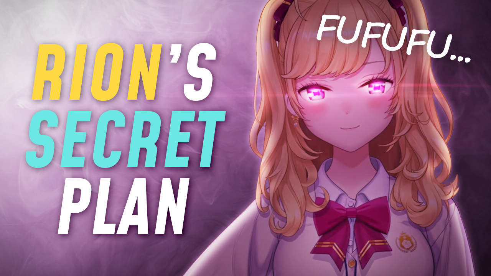

## Background

First off, we're going to make the smoky background, which is made up of two layers. First we create a linear gradient layer (Layer > New Fill Layer > Gradient, OR from  button on the Layers Panel) that goes from white to gray so that it looks like a light is coming from the top left.

Note: You can move the gradient by dragging on the image while its Gradient Fill window is open.

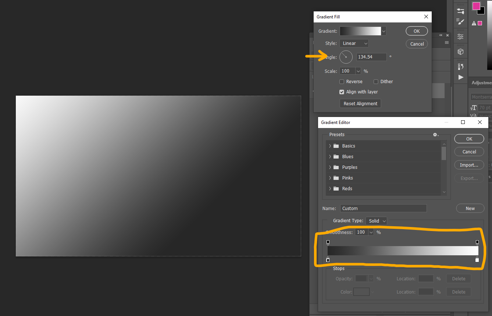

On top, we add a smoke texture from [texturelabs](https://texturelabs.org/?ct=19&pg=1) called "Atmosphere 195". Because it's overall gray and we want it to both darken and lighten the underlying layer, we want to use a blending mode from the contrast group. Here we use the **Linear Light** mode as an example. Reduce the fill or opacity until it looks good.

Side note: Watch [this video](https://youtu.be/i1D9ijh3_-I?t=28) to learn about the blending mode groups (and how they generally work) in Photoshop.

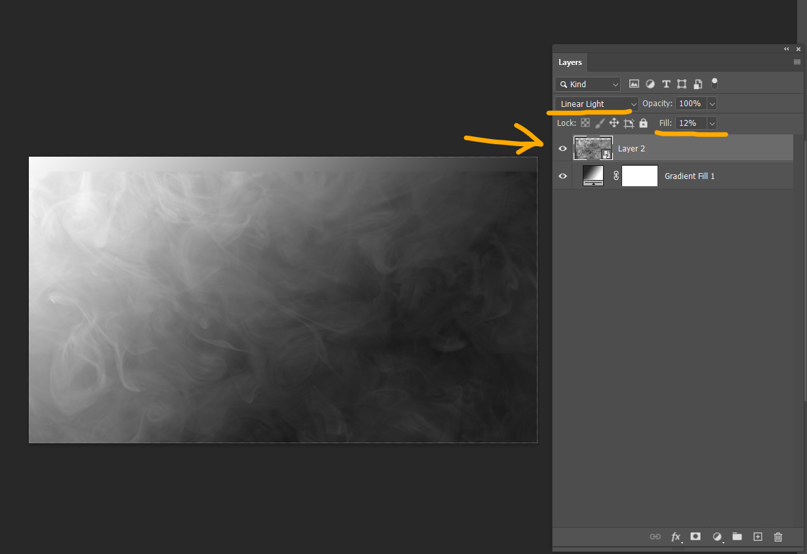

(You can see there's a gap at the top but it's a mistake, please ignore it)

## Subject

First, we place the subject at the top (here's the [link](https://drive.google.com/file/d/1MZdf72HWhaam4OrNEqFqYb64d7K-cQfP/view?usp=sharing) to this Rion image if you want to use it). And we add a **Satin** layer style to darken it while keeping the side edges bright. This makes it look like lights are coming from left and right.

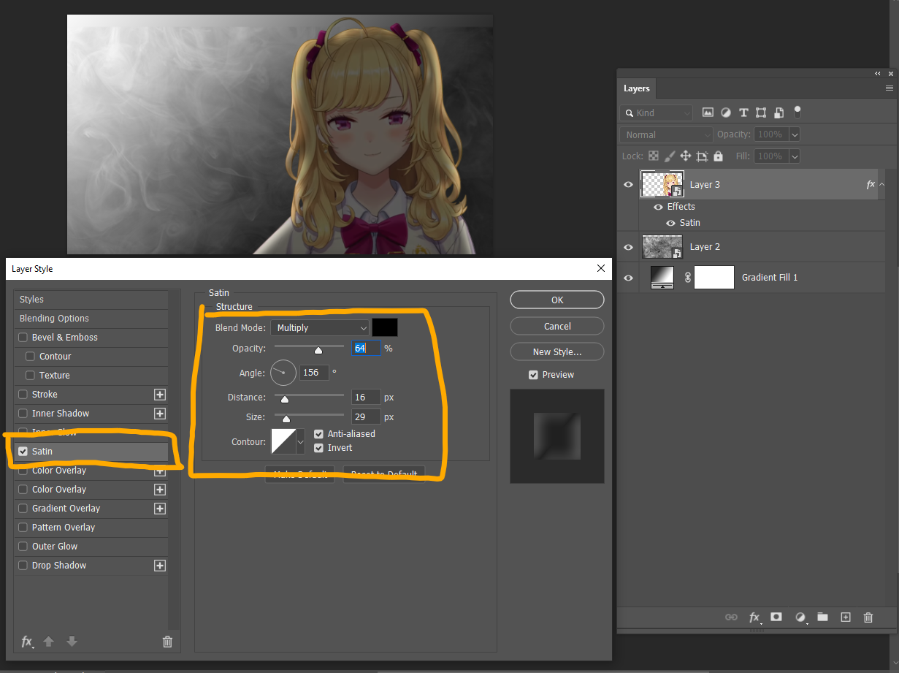

To add a bit more depth to the subject, slightly light up her face and chest with a solid color fill layer (Layer > New Fill Layer > Solid Color). We set its color to pure white, set its blending mode to **Color Dodge**, invert its layer mask (click the layer mask (to the left of the layer name) and press Ctrl-I). And while the layer mask is still selected, with a very soft and big brush (white color), tap (single click) on these areas. Reduce the Fill value to make it subtle.

Note: Of course you could do this using a normal layer but I like to use a solid color layer when it should have a single color.

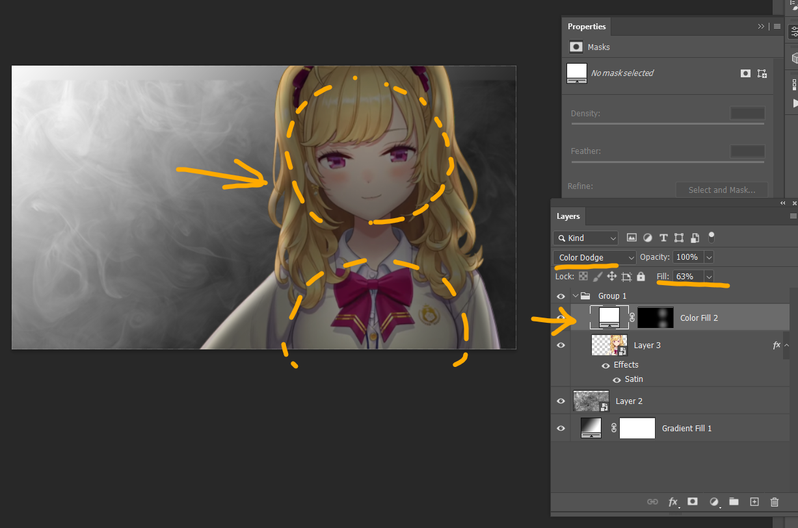

Next, we light up the eyes. This is also done by making a solid color layer with Color Dodge blending mode. Use a smaller brush and tap on her eyes. Don't forget to reduce the fill value.

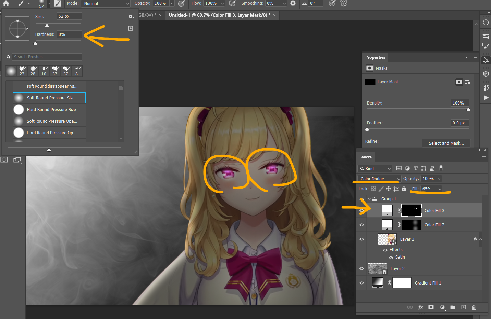

Then we add lens flares so that it looks like her eyes are emitting strong lights. Again, we're using a solid color layer with Color Dodge blending mode. Change its color to a light magenta color. 
And we use a brush from this wonderful free [lens flare brush pack](https://dr-designresources.blogspot.com/2015/01/42-lens-flare-brushes-photoshop-add-ons.html) and tap on her eyes.

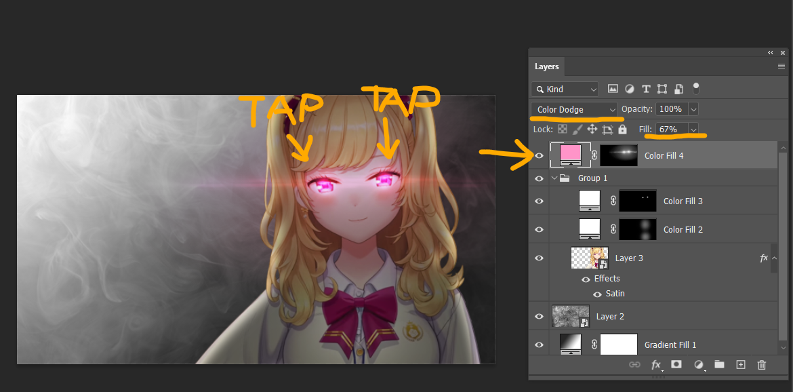

Finally, to make it more realistic, we add a slight white outer glow.

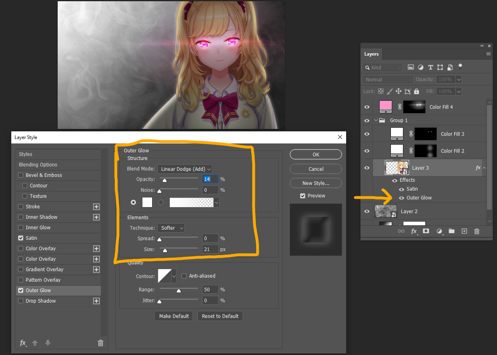

## Color Adjustments

And here's the fun part! Add a curves adjustment layer (Layer > New Adjustment Layer > Curves) and in the green curve, bring down a point in the middle like this. Now the whole image is magenta, and looks cools!

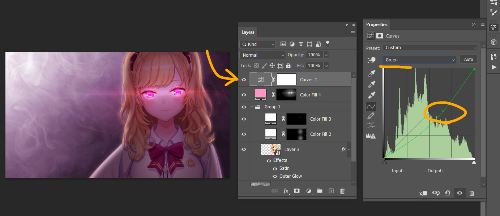

If it's too dark, bring up the RGB curve like this.

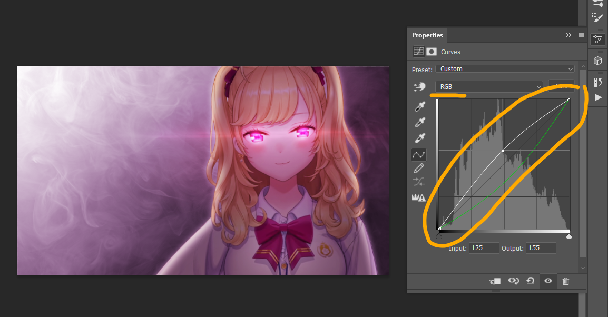

## Adding Texts

Finally we add some text. Of course the actual words in the text depend on what your video is about but here's an example. Drop shadow is useful to separate the text from the background when they have similar colors. FYI I used [Mohave](https://fonts.google.com/specimen/Mohave) font for the left text and Segoe Script for the right one.

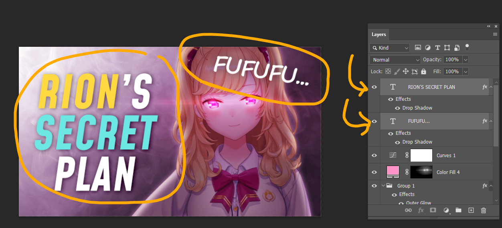

Done!

## Bonus: Color scheme

The reason I used these specific colors is that I was going for a triad color scheme. A triad color scheme is three colors evenly spaced in the color wheel (120 degrees apart from each other). In this case the subject (Takamiya Rion) already has these two colors (yellow and magenta) that are 120 degrees apart, so I chose cyan for the third color.

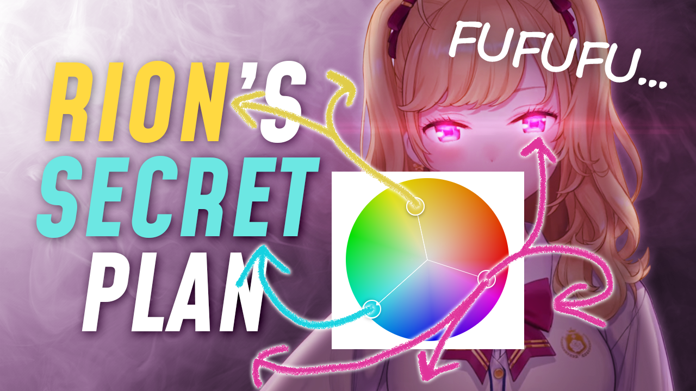

Depending on the colors of the subject, you might want to use a different set of colors (triad, complementary or even monochromatic). Here's a useful tool to pick a color scheme.

- https://color.adobe.com/create/color-wheel
