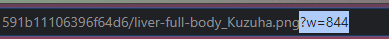
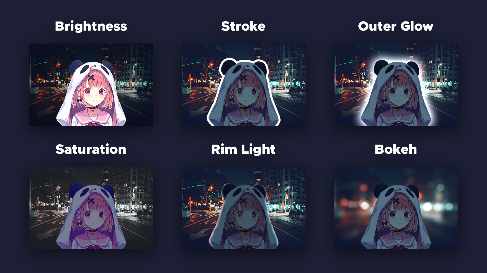
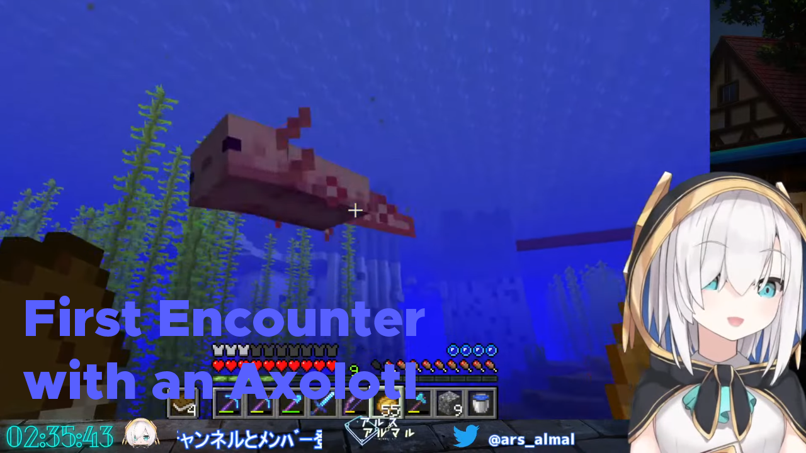
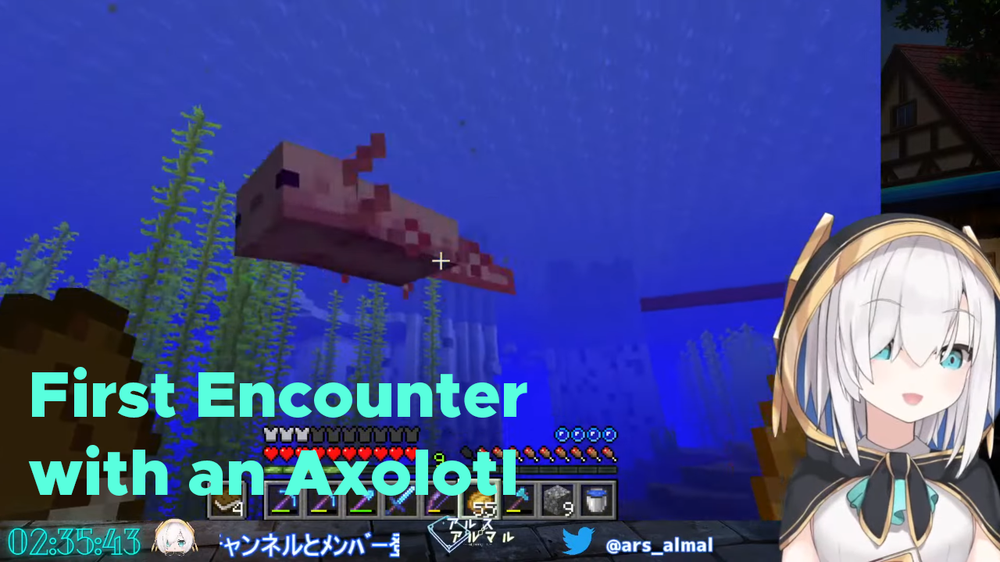
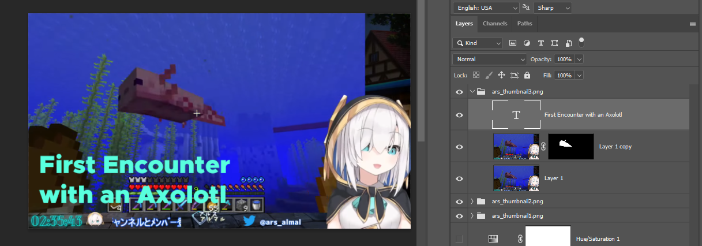
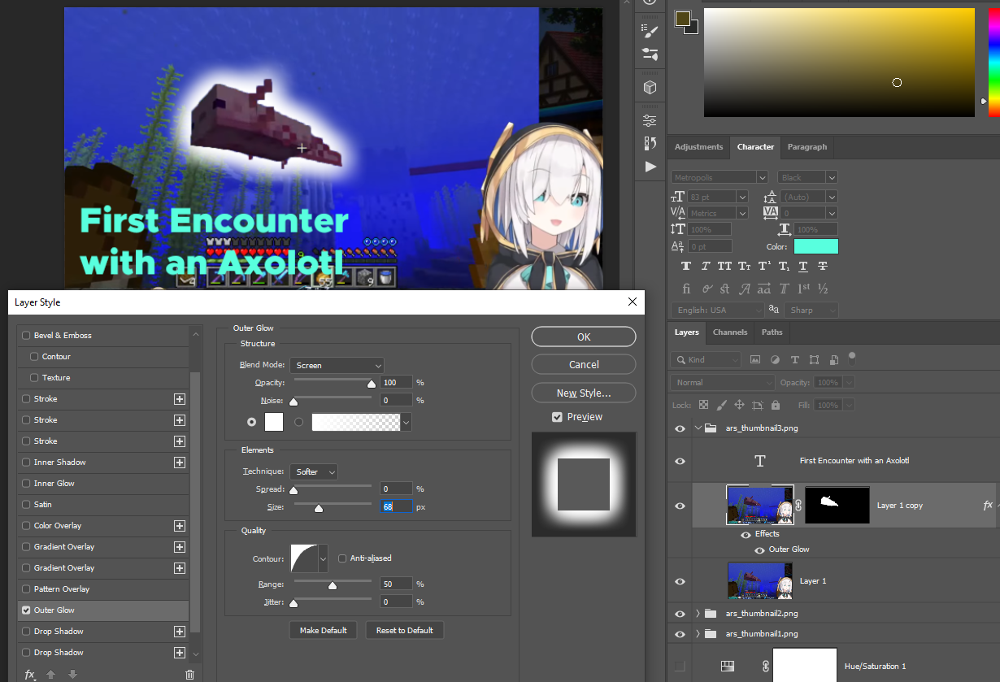
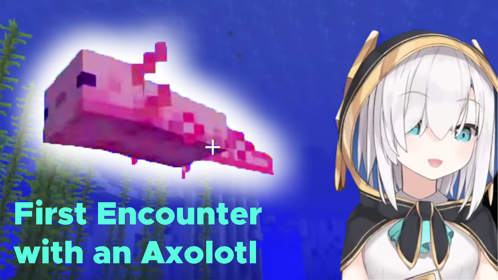
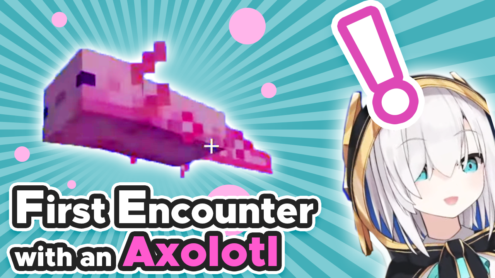

# Intro 

In this article I'll explain how to create a thumbnail for Vtuber clips. I'm in no way a professional in graphic design, but I've learned a lot in the last 12 months creating thumbnails and watching various tutorials on photoshop and graphic design; and I believe that learning just a few editing techniques/tips can make your thumbnails look 10x better. Sadly many people put little effort into making good-looking thumbnails, so hopefully you won't be one of them after reading this.

Note that the focus of this article is to create a *good-looking thumbnail*, not a click-baity one. Also, I'll be using Photoshop here. If you don't have Photoshop, you can use [Photopea](https://www.photopea.com/), which is a free browser based photoshop-like editor, but be aware that it doesn't have all the features of photoshop (like the `Select and Mask` tool). I recommend photoshop because it allows you to edit non-destructively; though all concepts here apply generally.

# Getting started

## 1. Obtaining images

Before you start working, you have to get image assets for the thumbnail. Here I'll explain how and where to get those resources.

### Vtuber avatar images

Avatars can be tricky to get, and most do not have a transparent background. There are mainly three sources for avatars:

- Official websites
  * Often in png format (allowing for a transparent background), but poses are limited
- Streams
  * Best source if you want specific facial expressions, but you have to manually remove the background
  * 新衣装 (new outfit reveal) streams are a good source because they often show the outfit on a green background which is relatively easy to remove
  * Make sure to set the video quality to the highest available, pause the stream, go into the fullscreen mode if necessary (YouTube shows the video in 720p (1280x720) by default (non-theater mode) when the browser window's size is 1920x1080), and then take a screenshot
    * On Windows 10, there's a handy keyboard shortcut (`Win + Shift + S`) for capturing a specific region of the screen
    * On Mac, it seems you can do the same with `Shift + Command + 4` but I've never tried
- Official tweets
  * Sometimes png, but mostly jpg where you have to remove the background. Usually high resolution.

#### Nijisanji website

For Nijisanji, you can get transparent images of all livers on the official member pages. The facial expressions on those images are kinda boring but they're quite high-res and very easy to get.

A little trick specific to their website is modifying the image URL to obtain a higher resolution. First, right click a liver's image and open it in a new tab.

You get an image 844px wide. Remove the `?w=844` at the end of the URL and hit enter. 

Now you get a bit of a bigger image (1000px wide as of the time of writing).

On a side note, I happen to run [a twitter account](https://twitter.com/NijisanjiAssets) that posts Nijisanji avatar images, including pre-isolated ones with transparent backgrounds that I edited manually.

### General image assets

There are several websites that offer stock images for free without any attribution requirements:

* Unsplash: https://unsplash.com/
* pixabay: https://pixabay.com/
* Pexels: https://www.pexels.com/
* PxHere: https://pxhere.com/
* StockSnap: https://stocksnap.io/

👇 This website kindly offers high quality textures for free. It even has a [yt channel](https://www.youtube.com/channel/UCBxd0ZwoptXc676LSaxCP5Q) which explains how to creatively use these textures (I personally find the channel really useful).

* Texturelabs: https://texturelabs.org/

### Fanart and other Assets

**DO NOT USE FANART OR OTHER POSTED WORK WITHOUT PERMISSION**. You **MUST** ask the content creator if you can use their asset in your thumbnail, unless they allow it explicitly. It does **not** matter if your channel is monetized or not.

## 2. Removing the background

Skip this step if you already have isolated avatar images with transparent backgrounds, or you don't need to remove the background. There are several ways to do this depending on the background. This step-by-step tutorial video is very helpful if you're new to photoshop:
- Precisely Cut Out Hair Using Color Range in Photoshop!: https://youtu.be/8nk1KkLn3CM

What I usually do is:
1. If the background is a solid color, open the color range tool, pick the background color, tick the "invert" checkbox and adjust the fuzziness so that the noises around the subject go away. Otherwise, use the quick selection tool.
1. Create a layer mask from the selection.
1. Open the "Select and Mask" dialog and tweak "Radius", "smooth", and "shift edge" to remove fringes (Note that Photopea doesn't have this feature).
1. Manually fine tune the layer mask by painting it with brush tool.
1. If the bg color is leaking inside the subject (which is often the case when the bg is colored (like green)), create a new layer above as a clipping mask, change the blending mode to "color", and paint over those areas with appropriate colors (use eye dropper to pick colors).

## 3. Compositing

This is the most important step, though there are no "steps" to follow. There are many ways to put things together, so use your creativity to create a great thumbnail. If you have no idea, try mimicking thumbnails created by other clippers. Here are some examples of channels that I personally think have good thumbnails.
- NIJISANJI English Official: https://www.youtube.com/channel/UC-JSeFfovhNsEhftt1WHMvg (simple yet effective)
- yamete kudasubs: https://www.youtube.com/channel/UChKhK5VrB_Ve6tqzp-OCNvQ (memey, eye-catching)
- kiri: https://www.youtube.com/channel/UC6tQJkSjDXB0Mg8jJwaBI3Q (clean and eye-pleasing)
- shimobe sub: https://www.youtube.com/channel/UCQgCB8g7Ed6Tmy1P7bEZxGQ (pop, eye-catching)
- and maybe my own channel: https://www.youtube.com/channel/UCtKVNhj4phqYXnvnEh7YMuQ (ignore early videos lol)

There are two basic rules for making a good-looking thumbnail: simplicity and separation.

### Simplicity
When you browse through videos on YT, most people spend only a few seconds or less looking at each thumbnail. We are lazy and ignore details. The whole point of a thumbnail is to summarize what the video is about. So keep it simple.

### Focus
You have to design the thumbnail in a way that draws viewers' attention to the important parts. Don't make your main subject blend in with the background, make them **stand out**. There are many ways to do this, like using outlines, drop shadows, increasing contrast between subjects and the background by altering colors, brightness, etc. Below are some examples of how to create contrast.

To learn more about composition, check out this great video by Blender Guru. 

- Understanding Composition: https://youtu.be/O8i7OKbWmRM

# Common mistakes and how to fix them
Let's take a look at typical examples of bad thumbnails. This is just a screencap of Ars's Minecraft stream with text slapped on it. Ars is cute.

## Text color

The first thing you notice is that the text is hard to read. Why? Because its color is very similar to that of the bg. You can simply change the color to fix the problem (we'll come back to this later).

Alright, now I changed the text color to light green which contrasts a lot from the bg.

## Focus

It looks still boring. One of the reasons is that there's no focus. You wanna draw viewers' attention to the axolotl (and maybe Ars), but it's dark and blending in with the sea in the back. You wanna introduce some contrast to make the animal stand out.

Here I'll make it glow. Duplicate the bg layer (ctrl-J), select the axolotl with quick selection tool, and create a layer mask from that selection (the circle-in-rectangle button on the bottom right of the Layers panel). Now you isolated the fish into a new layer.

Now add an outer glow effect (Layer -> Layer Style, or the "fx" button on the bottom right of the Layers panel). Tweak the parameters as you like.

It still looks dull, so I'll apply some adjustment layers on it to make it pop. Curves adjustment layer to brighten it up, and Hue/Saturation adjustment layer to make it more saturated. Note that you have to turn on "clipping mask" (right click a layer -> "Create clipping mask") for these adjustment layers so that they only affect the axolotl.

## Size

The next thing you wanna change is the size of things. Right now the subjects (the axolotl and Ars) stand out to some extent but they're too small.

Imagine it's put on the home page of YouTube like below. You can see how boring and awkward this thumbnail looks compared to the others. You can easily forget while working in your editor, that the thumbnail will be shown in a small size. I recommend periodically zooming out to check how your thumbnail looks in the size YouTube shows it in.

Let's make the subjects bigger. I'll first duplicate the bg, make the bottom one zoom up into the axolotl, and the other into Ars with a layer mask so that it only shows Ars. You can use free transform (ctrl-T) to scale up/down layers.

## Final touches

Finally, I'll add a few effects to make the image prettier. Again, there's no limit as to what you can do, but as an example, I'll add an outer glow to Ars too, add an exclamation mark to concisely represent her emotion, add a few strokes (borders) to the title text so that it looks nicer, add white lines towards the axolotl to make it stand out even more (I used "Vector 169" from [this page](https://texturelabs.org/?ct=364&pg=1) on texturelabs.com. I also applied a color overlay layer style to change its color).

Looks pretty good to me!

# Advanced tips

## Color scheme

If you wanna make your composition even more eye-pleasing, you wanna use a **color scheme**, which is a combination of colors that is known to play nicely together. I like to use a "complementary" or "triad" color scheme because more than three colors might be too much. The website below is useful for choosing a color scheme. 

- Adobe Color: https://color.adobe.com/create/color-wheel

I recommend this video to learn more about color schemes. It's informative and has a lot of examples.

- Understanding Color: https://youtu.be/Qj1FK8n7WgY

For our example thumbnail, the colors kind of match this triad color scheme below.

But the blue color of the sea doesn't really match any of these colors. So, for example I can remove the background entirely and put a cyan stripe background like below (I used "Vector 213" again from texturelabs.com).

Looks nice, doesn't it?

## Changelog

- 2021/08/25: Fix wording/grammar errors (Huge thanks to @chicken_onigiri for proofreading!)
- 2021/07/25: Initial release