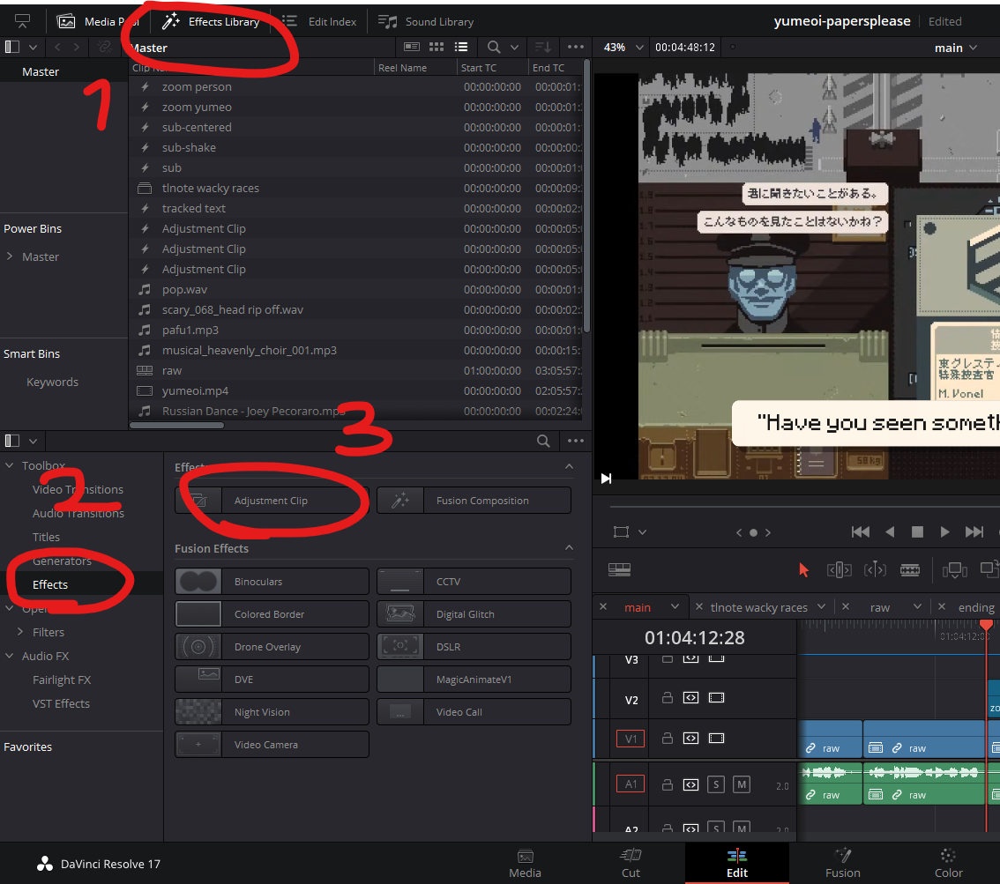
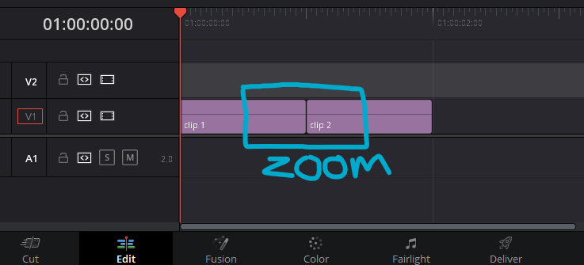
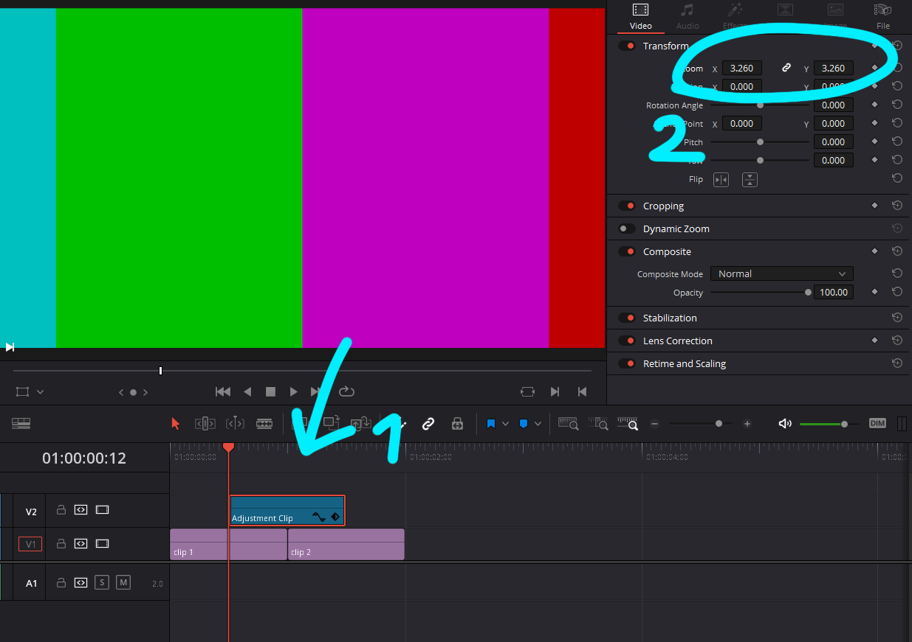
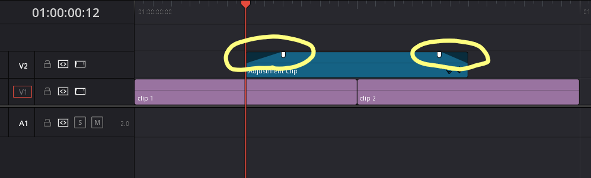
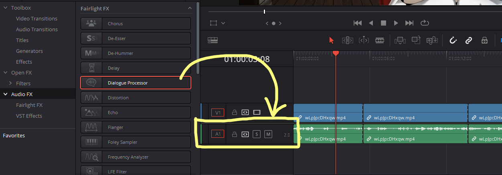

# [WIP] Davinci Resolve Editing Tips

In this article I'll explain a few tips for making Vtuber clips with Davinci Resolve. (But the same ideas apply to other software as well.)

## DaVinci Resolve

DaVinci Resolve is a full-blown video-editing software developed by Blackmagic Design, who makes both software and hardware for professional cinema stuff. It was originally known as a color grading tool, but after years of updates it's now a very powerful all-round video editing program.

There are two versions right now:
- DaVinci Resolve (free)
- DaVinci Resolve Studio (one-time paid, about $300)

I won't explain all the basics of Davinci Resolve here because there are lots of good tutorial videos on YouTube (and I definitely recommend you to watch some if you're not familiar). Here I'll just explain useful tips that might not be obvious from just watching those tutorials.

## Organizing Files

Before importing videos and assets, I **highly recommend** to organize those files into dedicated folders. Here's why: Generally, video editing programs do NOT copy the imported files to some project folder. They just remember the **locations** (file paths) of those files. Therefore, if you put all assets in a common folder (like `Downloads` folder) with other unrelated files, you'll quickly lose track of which files are used in a video project, and you might end up accidentally deleting some of them and breaking projects. It also makes it harder to find specific files.

Also, when you download some asset that requires crediting, I recommend you to IMMEDIATELY write down that credit info in a text file or something and put it alongside the asset, because otherwise you'd 100% forget it and end up uploading the video without crediting, which is... bad.

## Cutting

Here are some general good practices:

- Give just enough context
    - This depends a lot on what's the point of the clip. For example if you want to show a moment where a vtuber says a punchline, you can remove everything except what's required to fully understand the punchline.
- Cut out silent moments
    - unless you want to show how awkward the silence is or something
- Cut out long filler words
    - unless you want to show how the person is struggling to put their thought into words

## Adding Effects

I'm not explaining specific effects, but here's a very useful general tip: Use **adjustment clips**! You can find it here.

An adjustment clip is like a virtual layer such that **all effects you apply on it will affect all the layers below**.

Here's an example situation where it's useful. Let's say you want to add a zoom  effect across two clips like below.

Without adjustment clips, you have to animate the zoom value using keyframes, which is a hassle. You can put an adjustment clip on the part where you want to zoom, and change the zoom value like below.

It's also very easy to adjust the timings because you just have to move around the adjustment clip and never touch the real clips. And you can additionally use the fade handles on both ends like below to fade in/out the effects, which is very handy (If you don't see the handles, try zooming in vertically in the timeline by Shift + Scroll-up).

You can also add other kinds of effects to adjustment clips too, like adding any effects from the Effects Library panel or color grading in the Color tab. You can even use them as fusion clips where you can take all the layers below combined as an input node, and you can add all sorts of effects onto that input.

## Making the Audio Easier on the Ear

I find the raw voice audio in streams often a little tiring to hear because it often clips and sounds distorted or the dynamic range is too large (you know, VTubers often scream).

What I usually do to mitigate this issue is to add *compressor*. Compressor basically reduces the dynamic range by only reducing the volume of the loud parts. In Davinci Resolve you can do this by using the Dialogue Processor, one of the Audio FX in the Effects Library panel. You could add this to every single clip in the timeline but it's too much of a hassle and it'd also make it tedious to adjust parameters later. Therefore I recommend to add it to the **track** by dragging the effect onto this panel right here. Any effect you add to a track affects all the clips on the track.

Once you add it to a track, this fancy dialogue shows up. You can turn off other effects than Compressor but I like to also turn on Excite to reduce low frequency volume a bit.

On the Compressor panel, "Threshold" determines the volume such that all sounds louder than that threshold will be suppressed. "Amount" specifies how much they'll be suppressed. The little green meter shows how much it's reducing the volume in real time, which you can use as a feedback to fine tune parameters.

I'm not an audiophile but I find this works pretty well.
